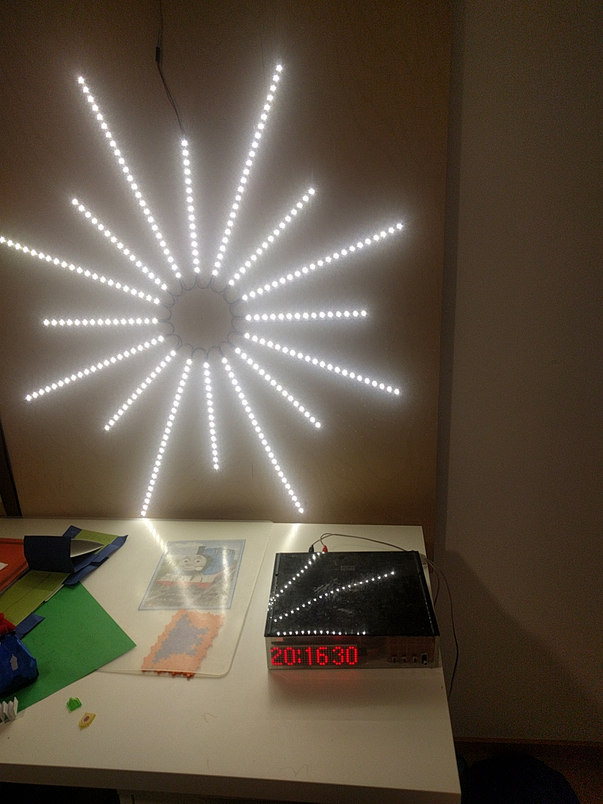
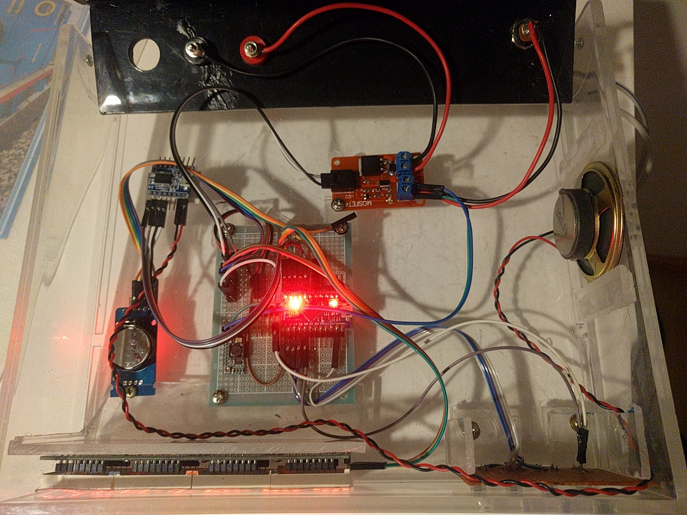

# AlarmSunClock
Alarm clock made with Arduino and cheap Chinese modules. 

Features
 * Matrix display 32*8 dots
 * Clock module with battery backup
 * MP3 module with programmable alarm tracks
 * Buttons for adjusting time and alarms
 * Switch for alarm
 * DIY casing
 * Voltage regulator for converting 12V to 5V
 * Arduino Pro Micro
 * PWM LED driver for
 * Sun LED board as a wake up light
 
 
